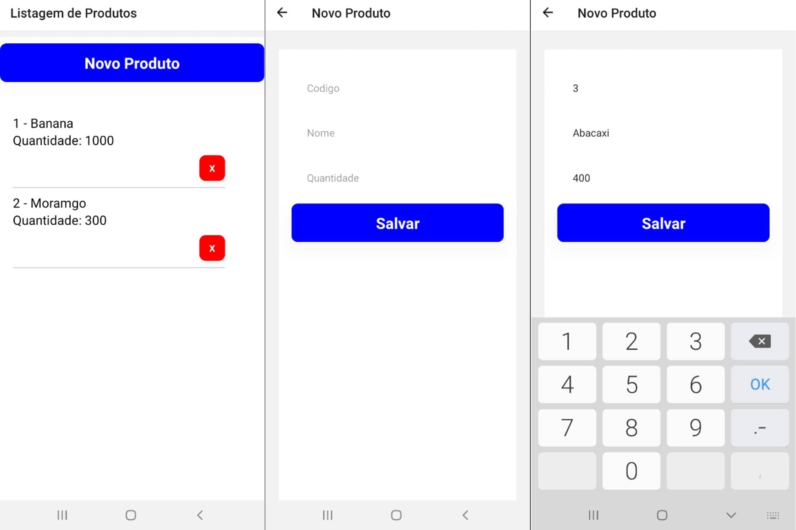

# Aplicativo cadastro de produto
## MobileAplicativo cadastro de produto | Mobile

Desenvolvido em React-Native | Android
O aplicativo realiza a tarefa de cadastrar e deletar produtos. São duas telas em sua stack, A primeira chamada "NOVO PRODUTO" para preencher os campos:

Código;
Nome;
Quantidade.

---
Sua segunda tela é disparada ao pressionar o botão "SALVAR". Será visualizado o item cadastrado em uma flatlist. A View tem o nome de "Listagem de Produtos" e exibe de forma imediata todos os produtos. No canto inferior direto de cada item a um botão de vermelho com um "X" no centro para excluir o item desejado. Para retornar a cadastrar produtos basta clicar em novo produto, ela chamará a tela de cadastro novamente.

Confira as imagens capturadas na plataforma de desenvolvimento Expo.

